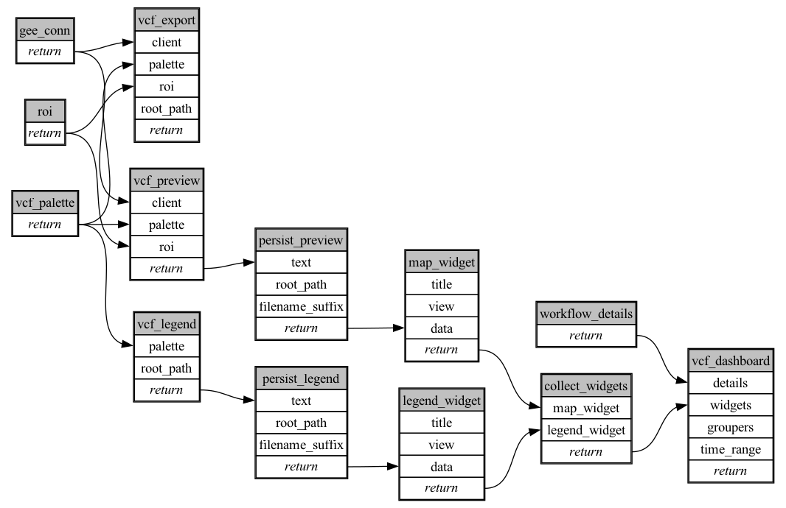

```
# AUTOGENERATED BY ECOSCOPE-WORKFLOWS; see fingerprint in README.md for details

```

```yaml
# fingerprint:
artifacts_sha256_basic: 8b299fbff4cab3458928c5c922e935bacedc17cfc7641fca81a88870a6cfb8f5
artifacts_sha256_strict: c3ea6dc9873cc5cccc5bcedad98ae83f24fa6c06505fda834c0f9f2b1386bf80
installed_requirements:
- channel: https://repo.prefix.dev/ecoscope-workflows/
  name: ecoscope-platform
  version: {version: ==2.11.15}
- channel: https://repo.prefix.dev/ecoscope-workflows-custom/
  name: vcf-basemap
  version: {version: ==0.1.2}
params_sha256: 95cb91c697c56c7deee8151fefafa2ff52dfdfd6b48be3fa309652b9138093d5
spec_sha256: fa197db806df49bc52549a2073e7d50ee4c3b7dc756193f24fe16b1fc554e6ed

```

# ecoscope-workflows-create-vcf-basemap-workflow


